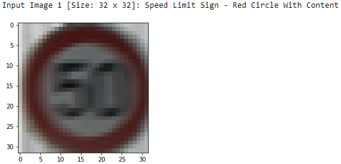

# UDACITY -- Self-Driving Car Engineer [NanoDegree] --
# Part-1--Project-02 - **Traffic Sign Classifier/Recognition**

# PROJECT WRITEUP

---

## GOALS OF THE PROJECT
The Goals/Steps of this Project are the following:
1. Data Sets Exploration:
   1. Load the Data Sets (See Below for Links to the Project Data Sets and Image Samples).
   2. Explore, Summarize and Visualize the Data Sets.
      * Output a Basic Summary of the Data Sets.
      * Output an Exploratory Visualization of the Data Sets.
2. Model Architecture - Design, Train and Test:
   1. Pre-Process the Data Sets.
   2. Model Architecture.
   3. Train, Validate and Test the Model.
   4. Output the Model's Validation and Test Accuracies with necessary Visualizations.
3. Use the Model to Make Predictions on New Images:
   1. Visualize the Images.
   2. Predict the Sign Type of the Images.
4. Analyze the Model's Performance on the New Images:
   1. Check the Overall Prediction Accuracy.
   2. Analyze the Softmax Probabilities for the New Images.
   3. Standout Option: Output Visualization of the Softmax Probabilities.
5. Summarize the Results in a Written Project Report [THIS DOCUMENT! :-)].
6. Optional Extra Step: Visualize the Feature Maps of the Model Layers for Sample Input Images.

## Image References
The Sample Data Sets are available at the Path ["../traffic-signs-data/"]("../traffic-signs-data/"),
i.e., In the Folder **traffic-signs-data** which is one level above the Project Folder.

The Data Sets are Segregated as:
1. Training Data Sets ("**train.p**").
2. Validation Data Sets ("**valid.p**").
3. Test Data Sets  ("**test.p**").

### Sample Images:

| Class     | Training Example   | Validation Example | Test Example       |
|:---------:|:------------------:|:------------------:|:------------------:|
| Class  0  |  |  |  |
| Class  2  |  |  |  |
| Class 13  |  |  |  |
| Class 20  |  |  |  |
| Class 37  |  |  |  |

---

## WRITEUP / README
This Document is the PROJECT WRITEUP / README.

## Project Rubric Points
In this Writeup, I will consider the [Project Rubric Points](https://review.udacity.com/#!/rubrics/481/view) individually and Describe how I addressed Each Point in my Implementation.

## Project Code
Here are the Links To:
1. [**My Project @ GitHub**](https://github.com/nmuthukumar/UDACITY_SDCarEngg-ND--P1--Prj02-TrafficSigns)
2. [**The Project Code @ GitHub -> Ipython NoteBook**](https://github.com/nmuthukumar/UDACITY_SDCarEngg-ND--P1--Prj02-TrafficSigns/blob/master/CarND-Traffic-Sign-Classifier/Traffic_Sign_Classifier.ipynb)


## 1 Data Sets Exploration - Explore, Summarize and Visualize the Data Sets:
### 1.1 Dataset Summary
- RUBRIC: Include a Basic Summary of the Data Sets. In the Code, the Analysis should be done using Python, Numpy and/or Pandas Methods rather than Manually Hardcoding the Results!

I simply used the Python Method `len()` to calculate the Summary Statistics of the Traffic Sign Data Sets:
* The Size of the Training   Set = 34799
* The Size of the Validation Set =  4410
* The Size of the Test       Set = 12630
* The Shape of the Traffic Sign Image Data =  (32, 32, 3) => Width = 32 Pixels, Height = 32 Pixels, Channels = 3 [R,G,B].

I went ahead and calculated the Total Number of Unique Traffic Sign Classes/Labels & the Class-wise Data Counts using the Numpy Method `np.unique()`:
* Number of Unique Classes/Labels in the Data Sets = 43

### 1.2 Exploratory Visualization
- RUBRIC: Include an Exploratory Visualization of the Data Sets.

Here is an Exploratory Visualization of the Data Sets. It is a Bar Chart showing the Distribution of Data Counts across the Traffic Sign Classes for each of the Data Set - Training, Validation & Test:


**Observations**:
* From the Visualization, it can be seen that the Counts are NOT Evenly Distributed across the Classes, Some of the Classes having very High Counts and Some very Low!
* However, the Overall Pattern of the Distribution across the Classes is roughly Similar between the Training, Validation & Test Data Sets.


## 2 Model Architecture - Design, Train and Test:
### 2.1 Pre-Process the Data Sets
- RUBRIC: Describe the Pre-Processing Techniques Used and Why These Techniques were chosen.

#### Normalization
As part of Pre-Processing of the Image Data, I only did a **Quick Normalization** using the following Formula,  
as Deep Learning Networks perform well for Data with Zero Mean and Equi-Variance!

   ```python
   Xout = (Xin - np.ceil(Xmax/2)) / np.ceil(Xmax/2) # Where Xin is the Input Image, Xout is the Normalized Output Image, Xmax = 255 for Color Images.
   ```

This is how an Example Image looks Before and After Normalization:  
[Note: The Normalized Image's Data Range is [-1.0 to +1.0] float.  
However, its Visualization is a Clipped Rendering by `imshow()`,  
where the Input Data is Clipped to the Valid RGB Range of [0 to 1] for floats for `imshow()`.]

| Before Normalization | After  Normalization |
|:--------------------:|:--------------------:|
|  |  |

It is Important to Note that the Normalized Pixel Data now Range from -1.0 to 1.0 (Zero Mean, Equi-Variance) instead of the Original 0 to 255!

#### Other Pre-Processing Techniques
As the Model achieved a decent Accuracy with just Normalization for the Training, Validation & Test Sets, I did NOT attempt Other possible Pre-Processing Techniques like:
* Adding Additional Data for Training.
* Augmenting Training Data [Image Rotation, Zoom, etc.].
* Grey-Scaling [Especially because I did NOT want the Model to Ignore the Color Info of the Signs, as I thought it will most probably prove helpful for Classification based on Color Features on the Traffic Signs].

Also, further I found that the Model works fairly Well even on the New Images that I took from Internet with just Scaling & Normalization as Pre-Processing Techniques (More on that follows later...).

### 2.2 Model Architecture
- RUBRIC: Provide Details of the Characteristics and Qualities of the Architecture, including the Type of Model used, the Number of Layers, the Size of Each Layer, Connectivity, etc. with possible Visualizations emphasizing Particular Qualities of the Architecture.

I based my Model on **LeNet-5 Architecture** as it is a very well-known CNN Model that works fairly well for Images!  
In order to Improve Model Performance & Accuracy, I added a **Dropout [keep probability = 0.5] just Before the Output Layer**, which I observed to Improve the Model's **Accuracy on Validation & Test Sets from `~0.935` to `~0.96`**.

Here is the Visualization of **My LeNet-5 Based CNN Model's Architecture:**


The following Table shows the **Model's Layer-wise Details**:

| **Layer**              | **Details**                                           | **Input**             | **Output**     |
|:----------------------:|:-----------------------------------------------------:|:---------------------:|:--------------:|
| **Input**              | Input Image                                           | **32x32x3 RGB Image** |                |
|                        |                                                       |                       |                |
|                        |                                                       |                       |                |
| **Layer 1:**           |                                                       |                       |                |
| **Convolution 1: 5x5** | 6 Feature Maps @ 28x28, strides=1x1, padding='VALID'  | 32x32x3               | 28x28x6        |
| Activation             | ReLU                                                  |                       |                |
| **Pooling**            | Max Pooling, strides=2x2                              | 28x28x6               | 14x14x6        |
|                        |                                                       |                       |                |
|                        |                                                       |                       |                |
| **Layer 2:**           |                                                       |                       |                |
| **Convolution 2: 5x5** | 16 Feature Maps @ 10x10, strides=1x1, padding='VALID' | 14x14x6               | 10x10x16       |
| Activation             | ReLU                                                  |                       |                |
| **Pooling**            | Max Pooling, strides=2x2                              | 10x10x16              | 5x5x16         |
|                        |                                                       |                       |                |
|                        |                                                       |                       |                |
| **Flatten**            | Flatten Before Full Connection Operations             | 5x5x16                | 400            |
|                        |                                                       |                       |                |
| **Layer 3:**           |                                                       |                       |                |
| **Full Connection**    |                                                       | 400                   | 120            |
| Activation             | ReLU                                                  |                       |                |
|                        |                                                       |                       |                |
| **Layer 4:**           |                                                       |                       |                |
| **Full Connection**    |                                                       | 120                   | 84             |
| Activation             | ReLU                                                  |                       |                |
| **Dropout**            | Keep Probability = 0.5                                |                       |                |
|                        |                                                       |                       |                |
|                        |                                                       |                       |                |
| **Layer 5:**           |                                                       |                       |                |
| **Full Connection**    | Final Output: **Logits**                              | 84                    | **43 Classes** |
|                        |                                                       |                       |                |
|                        |                                                       |                       |                |
| **Output:**            |                                                       |                       |                |
| **Softmax**            | Final Output: **Logits -> Softmax**                   |                       |                |
|                        |                                                       |                       |                |

#### Model Initialization
For the Initialization of Weights, I used the TensorFlow Function **`tf.truncated_normal()`** in order to Randomly Define Variables For the Weights and Biases For Each Layer.  
Further, I used the following Parameters for `tf.truncated_normal()`:
```python
mu    = 0
sigma = 0.1
```

#### Regularization
In order to Improve Model Accuracy and Reduce Overfitting, I added a **Dropout Layer** just Before the Final Output Layer, with a Keep Probability = 0.5.

### 2.3 Model Training - Train, Validate and Test the Model
- RUBRIC: Describe How the Model was Trained by discussing what Optimizer was used, Batch Size, Number of Epochs and Values for HyperParameters.

For **Model Training**, I used:
* **ADAM Optimizer** Function `tf.train.AdamOptimizer()`, as **ADAM Optimizer Algorithm**, which is an **Extension to SGD (Stochastic Gradient Descent)**, is known to work well for Deep Learning Applications in Computer Vision and Natural Language Processing and achieve Good Results relatively Faster!
* `BATCH SIZE    = 128`
* `EPOCHS        = 100`
* `Learning Rate = 0.001`
* Model's Dropout Layer's `Keep Probability = 0.5` for Training.

### 2.4 Solution Approach - Model's Validation and Test Accuracies with Visualizations
- RUBRIC: Describe the Approach to finding a Solution. Accuracy on the Validation Set shall be >= 0.93.

#### CODE
Please Refer to **My Code in [Jupyter NoteBook](https://github.com/nmuthukumar/UDACITY_SDCarEngg-ND--P1--Prj02-TrafficSigns/blob/master/Traffic_Sign_Classifier.ipynb)**.  

As mentioned earlier, I based my Model on **LeNet-5 Architecture** as it is a very well-known CNN Model that works fairly well for Images, and in this Traffic Sign Classifier we are dealing with Images!  
* The **Model Architecture Implementation** can be seen in **`Code Cell [7]`**.
* The **Model Training Pipeline** can be seen in **`Code Cells [8] To [12]`**.
* The **Model Evaluation Function** can be seen in **`Code Cell [14]`**.
* The **Actual Model Training** can be seen in **`Code Cell [15]`**.
* The **Final Model Testing** can be seen in **`Code Cell [16]`**.

#### APPROACH
Initially I went ahead with an Implementation of **LeNet-5 Architecture as is**.

For **Model Training & Validation**, I followed an **Iterative Approach** in order to achieve the **Expected Validation Accuracy of >= 0.93**:  
* **Trial-1:** I started my Model Training Exploration with the following **Parameters**:  
  ```python
  EPOCHS     =  10
  BATCH_SIZE = 128
  learn_rate = 0.001
  ```
  .  
  I got the **Result**:
  ```python
  EPOCH 10 ...:
  Validation Accuracy = 0.879
  ```
  .  
* **Trial-2:** As the above Result is definitely way Below the Expectation, I decided to **Increase Both the EPOCHS & BATCH SIZE** and check:
  ```python
  EPOCHS     =  20
  BATCH_SIZE = 256
  learn_rate = 0.001
  ```
  .  
  And, I got the **Result**:
  ```python
  EPOCH 20 ...:
  Validation Accuracy = 0.861
  ```
  .  
* **Trial-3:** As the above Result is definitely Deteriorating than before, I doubted **Overfitting** and so I now decided to **Keep the EPOCHS as the 1st Trial, but Reduce Learning Rate** and check. Also I **Reduced the Batch Size** so that the Model Learns in a Less Noisy way.:
  ```python
  EPOCHS     = 10
  BATCH_SIZE = 64
  learn_rate = 0.0001
  ```
  .  
  And, I got the **Result**:
  ```python
  EPOCH 10 ...:
  Validation Accuracy = 0.774
  ```
  .  
* **Trial-4:** Clearly, things are further Deteriorating!!! :-( I now thought More EPOCHS might be required for the Model to Learn fully and better. So I **Increased the EPOCHS to a very high Value** and tried:
  ```python
  EPOCHS     =  50
  BATCH_SIZE = 128
  learn_rate = 0.0001
  ```
  .  
  And, I got the **Result**:
  ```python
  EPOCH 50 ...:
  Validation Accuracy = 0.866
  ```
  .  
* **Trial-5:** Though in **Trial-4** I got a Better Value of **`Validation Accuracy = 0.866`**, it was still Less than that of **Trial-1's** **`Validation Accuracy = 0.879`**. So I realized that the **`Learning Rate = 0.0001`** is probably not helping much and it might be Too Slow for the Model! So I **Rolled-Back the Learning Rate** and now Tried the **Old Learning Rate of `0.001` together with a Higher Count for EPOCHS for that Rate**:
  ```python
  EPOCHS     =  50
  BATCH_SIZE = 128
  learn_rate = 0.001
  ```
  .  
  And, I got the **Result**:
  ```python
  EPOCH 50 ...:
  Validation Accuracy = 0.936
  Test Accuracy = 0.925
  ```
  .  
  So, **Now It seem to have Worked!**  
  The **`Validation Accuracy = 0.936`** is **> Project Expectation of `0.93`** for the 1st ever time!!! :-)  
  However, the **`Test Accuracy = 0.925`** is still a *'bit'* Less! :-(  
  .  
  So far I have been playing around only with the **Model Parameters**, but **NOT** with the **Model Architecture** itself! The **Model Architecture** has been the Same throughout, and so now I wanted to play around with that too and try whether things improve.  
  .  
* **Trial-6:** In order to try to **Improve Model Performance & Accuracy**, I added a **Dropout [keep probability = 0.5 for Training] just Before the Output Layer** and tried with:
  ```python
  EPOCHS     =  50
  BATCH_SIZE = 128
  learn_rate = 0.001
  ```
  .  
  And, I got the **Result**:
  ```python
  EPOCH 50 ...:
  Validation Accuracy = 0.965
  Test Accuracy = 0.938
  ```
  .  
  So, **At last, it really Worked!!! :-)**  
  The **`Validation Accuracy = 0.965`** is **Much > Project Expectation of `0.93`**! :-)  
  And, the **`Test Accuracy = 0.938`** too is **> Project Expectation**! :-)  
  .  
  But, before I wind-up, I wanted to run for one last time with even **Higher Count for EPOCHS** in order to make the **Model very Robust**.  
  .  
* **Trial-7:** For the **Final Run**, I tried with the following **Parameters**, still **Keeping the Dropout**:
  ```python
  EPOCHS     = 100
  BATCH_SIZE = 128
  learn_rate = 0.001
  ```
  .  
  And, now I got the **Final Result**:
  ```python
  EPOCH 100 ...:
  Validation Accuracy = 0.962
  Test Accuracy = 0.948
  ```
  .  
  The **`Validation Accuracy = 0.962`** went down a *'little'* bit than **Trial-6**, but the **`Test Accuracy = 0.948`** is the **Highest Ever so far!!! :-)**  
  So, I decided to wind-up with this **Model Architecture** and these **Parameters**.  
  .  

#### FINAL RESULTS
These Steps gave me the following **Final Results:**
* **Validation Accuracy = `0.962`**
* **Test       Accuracy = `0.948`**  
which are **Well Above** the **Project RUBRIC Expectations of `>=0.93`.**

Hence it Proves that the above **Model Architecture, i.e., LeNet-5 + Dropout** and the above **Choice of Parameters** works well for the **Traffic Sign Classification** Problem!

Following is the **Visualization for Model Loss Descent & Model Accuracy Ascent**.  
We can clearly see that the **Model's Accuracy** got to a **Good Value very Fast!** - which is a proven characteristic of the **ADAM Algorithm**.:  


## 3 Test the Model to Make Predictions on New Images:
### 3.1 Acquire & Visualize New Images
- RUBRIC: Include 5 New German Traffic Signs from Web, and Visualize the Images. Discuss Particular Qualities of these Images or Traffic Signs in these Images [E.g.: With respect to Difficulty for Model to Classify].

I wanted to choose the 5 New Images in a **Logically Distributed-Way** *as follows* in order to have a **Balanced Representation** with respect to Training & thus a **Fair Estimation of the Model's Accuracy:**

I decided to choose the **New Images** based on the **Corresponding Class Counts Distribution** in the **Training Dataset** and also based on **Varied Image Quality**, i.e.:  
* Represent both High Count Classes & Low Count Classes in the Training Dataset.
* Choose Images with Varied Image Quality - Both Clear and Noisy ones.

So, I wanted For Instance:
```
1. High Sample Count in Training Set, Test Image with Less Noise.
2. High Sample Count in Training Set, Test Image with More Noise.
3. Low  Sample Count in Training Set, Test Image with Less Noise.
4. Low  Sample Count in Training Set, Test Image with More Noise.
5. A Pseudo-Random Choice :-).
```

=> Therefore, I Chose:
```
1. Class 13 [Yield]                       : Training Count = 1920 (High), Clear Image.
2. Class  2 [Speed Limit (50km/h)]        : Training Count = 2010 (High), Image with more Blur.
3. Class 37 [Go Straight Or Left]         : Training Count =  180 (Low) , Clear Image.
4. Class  0 [Speed Limit (20km/h)]        : Training Count =  180 (Low) , Image with Blur and the Sign bit Rotated.
5. Class 20 [Dangerous Curve To The Right]: Training Count =  300 (Low) , Clear Image, but with a lot of Background Artefacts.
```

So, Here are the **Corresponding 5 New German Traffic Sign Sample Images** that I downloaded from Internet:

| Sign Class                              | Sample Image                                                                                                   |
|:---------------------------------------:|:--------------------------------------------------------------------------------------------------------------:|
| Class 13 [Yield]                        |                                                          |
| Class  2 [Speed Limit (50km/h)]         |                       |
| Class 37 [Go Straight Or Left]          |          |
| Class  0 [Speed Limit (20km/h)]         |                       |
| Class 20 [Dangerous Curve To The Right] |  |

I'm specifically interested to see my **Model's Performance** on the **Noisy Images corresponding to the Low Count Training Classes**, as it will be a good Indication of its **Accuracy**.


## 4 Analyze the Model's Performance on the New Images:
### 4.1 Prediction of the Sign Type of the New Images & Overall Prediction Accuracy
- RUBRIC: Document the Performance of the Model when Tested on the Captured Images. The Performance on the New Images is Compared to the Accuracy Results of the Test Set.

#### CODE
* The **Prediction/Classification Pipeline** can be seen in **`Code Cell [13]`**.
* The Code to do **Actual Prediction on New Images** can be seen in **`Code Cells [18] To [20]`**.

#### MODEL's PREDICTION RESULTS

| Image                                   | Prediction                              | Result |
|:---------------------------------------:|:---------------------------------------:|:------:|
| Class 13 [Yield]                        | Class 13 [Yield]                        | OK     |
| Class  2 [Speed Limit (50km/h)]         | Class  2 [Speed Limit (50km/h)]         | OK     |
| Class 37 [Go Straight Or Left]          | Class 37 [Go Straight Or Left]          | OK     |
| Class  0 [Speed Limit (20km/h)]         | Class  0 [Speed Limit (20km/h)]         | OK     |
| Class 20 [Dangerous Curve To The Right] | Class 20 [Dangerous Curve To The Right] | OK     |

Interestingly, the Model was able to **Correctly guess ALL 5 of these 5 New Traffic Signs**  
=> The Model performed with an **Overall Accuracy = 100%** on these 5 New Images, which is pretty **Good** and **Compares Well** with the **Test Accuracy = 94.8%!**  
Especially, the Model has performed **Good** even on the **Noisy Images corresponding to the Low Count Training Classes!**

### 4.2 Model Certainty - Softmax Probabilities
- RUBRIC: Output & Analyze the Top 5 Softmax Probabilities of the Predictions on the New Images. Discuss How Certain or Uncertain the Model is of its Predictions.
- **STANDOUT OPTION**: Output Graphical Visualization of the Soft-Max Probabilities [E.g.: Bar Charts].

#### CODE
* The Code to extract the **Top 5 Softmax Probabilities** can be seen in **`Code Cell [22]`**, with its corresponding Output Below the Cell.

#### Prediction for Image-1: Class 13 [Yield]
For **Image-1**, the **Model is Extremely Sure** that this is a **Yield** Sign **(`Prediction Probability = 1.00`)** and the Image indeed contains a 'Yield' Sign.

The **Top 5 Softmax Probabilities** were:

| Prediction Probability | Prediction Class                |
|:----------------------:|:-------------------------------:|
| 1.00000000e+00         | Class 13 [Yield]                |
| 0.00000000e+00         | Class  0 [Speed Limit (20km/h)] |
| 0.00000000e+00         | Class  1 [Speed Limit (30km/h)] |
| 0.00000000e+00         | Class  2 [Speed Limit (50km/h)] |
| 0.00000000e+00         | Class  3 [Speed Limit (60km/h)] |

**Softmax Probabilities Visualization**:  


#### Prediction for Image-2: Class  2 [Speed Limit (50km/h)]
For **Image-2**, the **Model is Fairly Sure** that this is a **Speed Limit (50km/h)** Sign **(`Prediction Probability ~= 0.84`)** and the Image indeed contains a 'Speed Limit (50km/h)' Sign.  
Further, as a **2nd Prediction** the Model thinks this could be a **Speed Limit (30km/h)** Sign with **(`Prediction Probability ~= 0.16`)**. This could be because of the **Blur** in the **Input Image**, and it is Good to see that the Model's Prediction Confidence is not much disturbed in spite!

The **Top 5 Softmax Probabilities** were:

| Prediction Probability | Prediction Class                 |
|:----------------------:|:--------------------------------:|
| 8.41961741e-01         | Class  2 [Speed Limit (50km/h)]  |
| 1.58038273e-01         | Class  1 [Speed Limit (30km/h)]  |
| 3.13639745e-08         | Class  8 [Speed Limit (120km/h)] |
| 1.60696068e-09         | Class  4 [Speed Limit (70km/h)]  |
| 8.02885647e-10         | Class  5 [Speed Limit (80km/h)]  |

**Softmax Probabilities Visualization**:  


#### Prediction for Image-3: Class 37 [Go Straight Or Left]
For **Image-3**, the **Model is Extremely Sure** that this is a **Go Straight Or Left** Sign **(`Prediction Probability = 1.00`)** and the Image indeed contains a 'Go Straight Or Left' Sign.

The **Top 5 Softmax Probabilities** were:

| Prediction Probability | Prediction Class                |
|:----------------------:|:-------------------------------:|
| 1.00000000e+00         | Class 37 [Go Straight Or Left]  |
| 0.00000000e+00         | Class  0 [Speed Limit (20km/h)] |
| 0.00000000e+00         | Class  1 [Speed Limit (30km/h)] |
| 0.00000000e+00         | Class  2 [Speed Limit (50km/h)] |
| 0.00000000e+00         | Class  3 [Speed Limit (60km/h)] |

**Softmax Probabilities Visualization**:  


#### Prediction for Image-4: Class  0 [Speed Limit (20km/h)]
For **Image-4**, the **Model is Very Sure** that this is a **Speed Limit (20km/h)** Sign **(`Prediction Probability ~= 0.99`)** and the Image indeed contains a 'Speed Limit (20km/h)' Sign.  
Further, as a **2nd Prediction** the Model thinks **'a very little bit'** that this could be a **Speed Limit (70km/h)** Sign with **(`Prediction Probability ~= 0.0089`)**. This could be because of the **Blur** & **Small Rotation** in the **Input Image**, and it is Good to see that the Model's Prediction Confidence is not much disturbed in spite!

The **Top 5 Softmax Probabilities** were:

| Prediction Probability | Prediction Class                 |
|:----------------------:|:--------------------------------:|
| 9.91114616e-01         | Class  0 [Speed Limit (20km/h]   |
| 8.88536964e-03         | Class  4 [Speed Limit (70km/h)]  |
| 1.19732688e-18         | Class  1 [Speed Limit (30km/h)]  |
| 1.94118286e-29         | Class  8 [Speed Limit (120km/h)] |
| 1.61825342e-30         | Class  5 [Speed Limit (80km/h)]  |

**Softmax Probabilities Visualization**:  


#### Prediction for Image-5: Class 20 [Dangerous Curve To The Right]
For **Image-5**, the **Model is Extremely Sure** that this is a **Dangerous Curve To The Right** Sign **(`Prediction Probability ~= 1.00`)** and the Image indeed contains a 'Dangerous Curve To The Right' Sign.

The **Top 5 Softmax Probabilities** were:

| Prediction Probability | Prediction Class                                        |
|:----------------------:|:-------------------------------------------------------:|
| 1.00000000e+00         | Class 20 [Dangerous Curve To The Right]                 |
| 4.52873583e-26         | Class 25 [Road Work]                                    |
| 4.30593242e-33         | Class 24 [Road Narrows On The Right]                    |
| 1.01340694e-36         | Class 10 [No Passing For Vehicles Over 3.5 Metric Tons] |
| 4.07336024e-38         | Class  5 [Speed Limit (80km/h)]                         |

**Softmax Probabilities Visualization**:  


## 5 OPTIONAL EXTRA STEP: Visualize the Feature Maps of the Deep Neural Network Model Layers for Sample Input Images
I went ahead with the **Optional Extra Step** as I was very **Curious** to see the **Internals of my Deep Neural Network**.

#### CODE
* The Code to **Visualize** the **Neural Network's Internal States** with **Test Images** can be seen in **`Code Cell [23]`**, with its corresponding Output Below the Cell.

#### VISUALIZATIONS Of My TRAINED NETWORK's FEATURE MAPS
I wanted to Visualize my **Network's Inner Weights & Activations** to the **Letters in Traffic Signs** by Comparing the **Feature Maps** of my **Model's Convolution Layers** from a Test Image containing a **Traffic Sign With Letters** and another Test Image containing a **Traffic Sign WithOUT Letters**.

##### **1. Test Image-1: 'Speed Limit' Sign - Red Circle With Content**



##### **2. Test Image-2: 'No Through Road' Sign - Red Circle WithOUT Content**


#### CONCLUSION
Thus, from the above Visualizations showing the Comparison of the **CNN's Feature Maps** for **Similar Traffic Signs With and WithOUT Letters**, we can clearly see that the **Trained Neural Network's Inner Weights** have **High Activations** to the **Edges of the Patterns and Letters** in the Traffic Signs.

Thus, the CNN is indeed looking for these Significant Characteristics of the Traffic Signs and then makes out the **Differences in Feature Maps** between **Traffic Signs With and WithOUT such Specific Characteristics** in order to make the **Classifications**, which is perfectly in line with the Expectation on the Neural Network!


---
---
---
